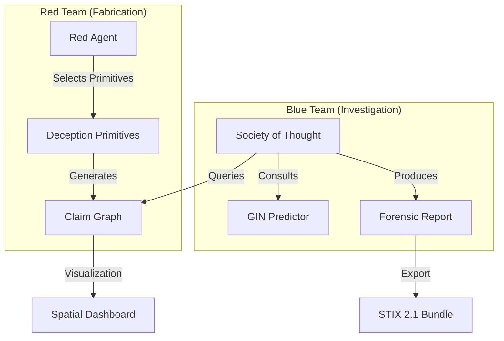

# 🔍 FORGE-MA: Forensic Multi-Agent Investigation Platform

[](https://www.python.org/downloads/)
[](https://fastapi.tiangolo.com/)
[](https://nextjs.org/)
[](https://pytorch.org/)
[](LICENSE)

**FORGE-MA** (Forensic Multi-Agent) is an end-to-end framework for *forensic-grade* misinformation detection. Unlike traditional classifiers that provide a simple binary verdict, FORGE-MA reconstructs the entire **tactic chain**—the sequence of deception primitives used to fabricate a claim—providing a transparent audit trail for analysts.

---

## 🌟 Key Features

- **Adversarial Self-Play**: Red Team (HAE+GIN) vs. Blue Team (SoT+GIN) co-evolutionary training.
- **Society of Thought (SoT)**: A collaborative investigation process involving 4 specialist agents (Auditor, Historian, Critic, and NegotiatedSearch) across different LLM providers (Groq, Cerebras, Mistral, OpenRouter).
- **9 Investigative Task Types**: From fabricated statistics and out-of-context imagery to coordinated SEC fraud and "Plandemic" conspiracy theories.
- **Spatial SaaS Dashboard**: A modern Next.js interface with real-time 3D graph visualizations of evidence chains and forensic artifacts.
- **STIX 2.1 Integration**: Export forensic findings into standardized STIX 2.1 bundles for inter-agency intelligence sharing.

---

## 🏗️ Architecture



### 8 Deception Primitives (DISARM-Aligned)
| Primitive | DISARM ID | Description |
|-----------|-----------|-------------|
| **SOURCE_LAUNDER** | T0013.001 | Insert low-trust intermediary domains |
| **TEMPORAL_SHIFT** | T0046 | Backdate publication timestamps |
| **ENTITY_SUBSTITUTE**| T0075.001 | Replace named entities with misleading ones |
| **QUOTE_FABRICATE** | T0006 | Fabricate attributed quotes |
| **CONTEXT_STRIP** | T0019.001 | Remove qualifying context |
| **CITATION_FORGE** | T0016 | Create fake academic/legal citations |
| **NETWORK_AMPLIFY** | T0049 | Simulate coordinated bot amplification |
| **SATIRE_REFRAME** | T0085.001 | Repackage satire as factual news |

---

## 🚀 Getting Started

### Prerequisites
- Python 3.10+
- Node.js & npm (for the dashboard)
- LLM API Keys (configured in `.env`)

### Local Setup

1. **Clone the repository**:
   ```bash
   git clone https://github.com/your-repo/forge-ma.git
   cd forge-ma
   ```

2. **Install Python dependencies**:
   ```bash
   pip install -r requirements.txt
   ```

3. **Initialize the Dashboard**:
   ```bash
   cd spatial-saas
   npm install
   ```

### Running the Platform

For convenience, use the provided batch script (Windows):
```bash
run_forge.bat
```

Alternatively, start the components manually:

- **Backend API**: `py -m uvicorn server.main:app --host 0.0.0.0 --port 7860`
- **Frontend Dashboard**: `cd spatial-saas && npm run dev`

Access the dashboard at **[http://localhost:3000](http://localhost:3000)**.

---

## 📊 Training & Evaluation

FORGE-MA uses **Tactic Edit Distance (TED)** as its primary metric, rewarding agents for identifying the *root cause* of misinformation early in the chain.

- **Pretraining**: Run `python pretrain.py` to initialize Red and Blue neural weights.
- **RL Training**: Use the provided `training/trl_forge_ma.ipynb` to fine-tune your own investigator using GRPO.
- **Baselines**: Run `python scripts/run_baseline.py` to compare against heuristic and prompted LLM baselines.

---

## 📜 License

This project is licensed under the Apache License 2.0. See the [LICENSE](LICENSE) file for details.

*Developed for the Meta × HuggingFace OpenEnv Hackathon.*
